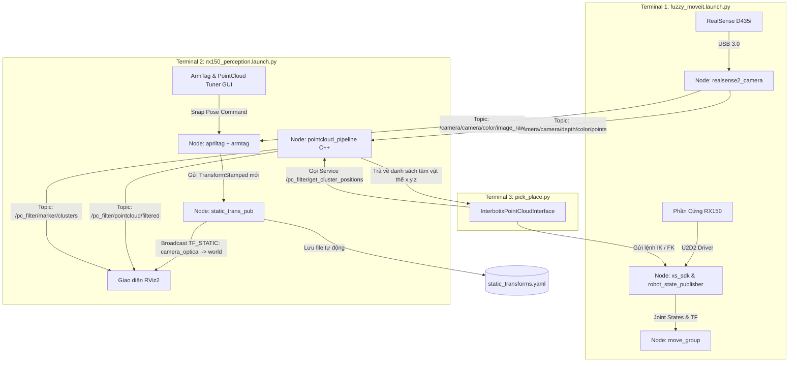

# BÁO CÁO VẬN HÀNH & NHẬT KÝ XỬ LÝ SỰ CỐ PERCEPTION - RX150

**Hệ thống:** Cánh tay Robot Interbotix RX150 + Camera Intel RealSense D435i + ROS 2 Humble  
**Bộ điều khiển:** `rx150_fuzzy_controller` (PWM closed-loop + MoveIt)  
**Pipeline Thị giác:** `interbotix_perception_modules` (PCL C++ Filter + ArmTag Calibration + Static TF Tools)  
**Ngày hoàn thiện:** 23/08/2026 · **Cập nhật:** 27/08/2026

> **Trạng thái 27/08/2026 — guide này VẪN DÙNG ĐƯỢC.** Hai luồng perception song song:
> - **Luồng PCL (guide này):** pc_filter + ArmTag + `demos/pick_place.py`. Thay đổi duy
>   nhất: Terminal 1 phải thêm `rs_camera_pointcloud_enable:=true` (xem mục 2.1).
> - **Luồng YOLO (gắp ống nghiệm):** `yolo_tube_detector_node` + `tube_rack.launch.py`
>   (package `rx150_pick_place`) — không cần point cloud, chạy trên GPU A4000.
>
> Phần **hiệu chuẩn ArmTag (mục 2.2)** dùng chung cho CẢ HAI luồng — calib một lần,
> `static_transforms.yaml` phục vụ cả PCL lẫn YOLO.

---

## MỤC LỤC
- [BÁO CÁO VẬN HÀNH \& NHẬT KÝ XỬ LÝ SỰ CỐ PERCEPTION - RX150](#báo-cáo-vận-hành--nhật-ký-xử-lý-sự-cố-perception---rx150)
  - [MỤC LỤC](#mục-lục)
  - [1. KIẾN TRÚC HỆ THỐNG \& LUỒNG DỮ LIỆU](#1-kiến-trúc-hệ-thống--luồng-dữ-liệu)
  - [2. QUY TRÌNH VẬN HÀNH CHUẨN (SOP)](#2-quy-trình-vận-hành-chuẩn-sop)
    - [2.0 Cách nhanh: chạy tất cả trên MỘT terminal](#20-cách-nhanh-chạy-tất-cả-trên-một-terminal)
      - [Mặc định là "YOLO-only" (đổi 2026-08-28)](#mặc-định-là-yolo-only-đổi-2026-08-28)
    - [2.1 Khởi động Robot, MoveIt và Camera](#21-khởi-động-robot-moveit-và-camera)
    - [2.2 Khởi động Perception Pipeline \& Hiệu chuẩn TF](#22-khởi-động-perception-pipeline--hiệu-chuẩn-tf)
    - [2.3 Sử dụng PointCloud Tuner GUI *(nhánh PCL — legacy)*](#23-sử-dụng-pointcloud-tuner-gui-nhánh-pcl--legacy)
    - [2.4 Chạy Demo Tự Động Gắp Thả *(nhánh PCL — legacy)*](#24-chạy-demo-tự-động-gắp-thả-nhánh-pcl--legacy)
    - [2.5 Demo Phân Loại Ống Nghiệm Theo Màu (nhánh YOLO)](#25-demo-phân-loại-ống-nghiệm-theo-màu-nhánh-yolo)
    - [2.6 Giới hạn vùng nhận diện (ROI Box)](#26-giới-hạn-vùng-nhận-diện-roi-box)
  - [3. NHẬT KÝ SỰ CỐ KỸ THUẬT \& CÁCH KHẮC PHỤC](#3-nhật-ký-sự-cố-kỹ-thuật--cách-khắc-phục)
    - [Sự cố 1: Không hiện mô hình Robot 3D trên RViz](#sự-cố-1-không-hiện-mô-hình-robot-3d-trên-rviz)
    - [Sự cố 2: Thêm PointCloud2 vào RViz nhưng màn hình trống trơn (Lỗi QoS)](#sự-cố-2-thêm-pointcloud2-vào-rviz-nhưng-màn-hình-trống-trơn-lỗi-qos)
    - [Sự cố 3: Đổi Fixed Frame về `world` thì PointCloud biến mất (Lỗi Multiple TF Parents)](#sự-cố-3-đổi-fixed-frame-về-world-thì-pointcloud-biến-mất-lỗi-multiple-tf-parents)
    - [Sự cố 4: MoveIt báo lỗi `Catastrophic failure / Unable to solve` khi về Home](#sự-cố-4-moveit-báo-lỗi-catastrophic-failure--unable-to-solve-khi-về-home)
    - [Sự cố 5: AprilTag bị lệch vị trí \& Robot bị xoay 90 độ sau khi Snap](#sự-cố-5-apriltag-bị-lệch-vị-trí--robot-bị-xoay-90-độ-sau-khi-snap)
  - [4. BẢNG TRA CỨU CẤU HÌNH \& FILE NGUỒN](#4-bảng-tra-cứu-cấu-hình--file-nguồn)

---

## 1. KIẾN TRÚC HỆ THỐNG & LUỒNG DỮ LIỆU

Hệ thống được thiết kế phân tầng rõ ràng, đảm bảo camera, thuật toán lọc điểm 3D và cánh tay robot phối hợp chuẩn xác theo kiến trúc chính hãng Interbotix:



---

## 2. QUY TRÌNH VẬN HÀNH CHUẨN (SOP)

### 2.0 Cách nhanh: chạy tất cả trên MỘT terminal
```bash
source ~/RX150_Hedge_Algebra_Control/install/setup.bash
ros2 launch rx150_fuzzy_controller fuzzy_moveit_perception.launch.py
```
File launch này gộp sẵn Terminal 1 + 2 + 3 bên dưới: `use_camera:=true`, camera static TF +
hand-eye tắt, perception chạy `use_camera:=false` (tránh "Device or resource busy"), và
**`yolo_tube_detector_node.py` chạy luôn** (`use_yolo:=true`). Perception + YOLO hoãn 5 s
(`perception_start_delay`) cho camera + `robot_state_publisher` lên trước. Ctrl+C một lần
tắt sạch mọi nhánh.

#### Mặc định là "YOLO-only" (đổi 2026-08-28)

Nhánh PCL **tắt sẵn**: `use_pointcloud_tuner_gui:=false`, và `pc_filter` cũng không được dựng
(arg mới `use_pcl_pipeline` bám theo cùng công tắc). Lý do: `yolo_tube_detector_node` tự
deproject depth bằng `camera_info` nên chỉ cần `/camera/camera/color/image_raw` +
`/camera/camera/aligned_depth_to_color/image_raw`, **không** đọc
`/camera/camera/depth/color/points` lẫn `/pc_filter/*`. Trong toàn workspace giờ chỉ còn
`demos/pick_place.py` (bản port upstream Interbotix) dùng `InterbotixPointCloudInterface`.

Riêng `rs_camera_pointcloud_enable` vẫn **`true`** — đám mây điểm không còn phục vụ thuật toán
nào nữa, giữ lại thuần để **nhìn** trong RViz (display `RawPointCloud`) cho dễ căn cảnh và soi
chất lượng depth. Đây là chi phí hiển thị ~295 MB/s: đặt `false` thì mất hình, **không** mất
chức năng — YOLO, calib TF, gắp thả đều chạy y nguyên. Máy ì thì tắt trước tiên.

> ⚠️ `align_depth.enable` là arg **riêng** (`rs_camera_align_depth_enable`, mặc định `true`),
> không dính `pointcloud.enable`. Nên tắt pointcloud **không** làm mất ảnh depth đã align mà
> YOLO sống nhờ nó. Đừng gộp hai cờ này lại.
>
> Cũng đừng hạ `rs_camera_depth_profile` để giảm tải: ảnh depth đã align lấy từ chính stream đó,
> hạ xuống là YOLO đo z kém chính xác theo.

`use_armtag_tuner_gui` để **bật sẵn** (mặc định `true`) — chỉ là một cửa sổ Qt nhỏ, gần như
không tốn tài nguyên, mà lúc cần snap lại thì có ngay. Nhưng phân biệt cho rõ hai thứ:

* *Pipeline* armtag + `static_trans_pub` **luôn chạy**, không có công tắc, và **bắt buộc phải
  có**. YOLO publish pose trong `rx150/base_link` bằng cách lookup TF
  `camera_color_optical_frame → base_link`; TF đó đọc từ
  [`config/static_transforms.yaml`](../config/static_transforms.yaml). Mất nó thì detect vẫn ra
  nhưng toạ độ gắp sai.
* *GUI Snap Pose* chỉ là công cụ **ghi đè** TF đó bằng ảnh AprilTag. Tắt (`:=false`) **không**
  mất calib — giá trị đã lưu trong YAML vẫn được phát bình thường.

**Mở GUI khi stack đã chạy rồi** (khỏi phải Ctrl+C toàn bộ):
```bash
ros2 run interbotix_perception_modules armtag_tuner_gui --ros-args \
    -r __ns:=/armtag \
    -p ref_frame:=camera_color_optical_frame \
    -p arm_base_frame:=world \
    -p arm_tag_frame:=rx150/ar_tag_link \
    -p position_only:="'false'"
```
> Để ý dấu nháy lồng ở `position_only`: node khai báo tham số này kiểu **STRING**, còn
> `-p position_only:=false` trần bị CLI hiểu thành BOOL và node **crash ngay lúc init**
> (*InvalidParameterTypeException ... expecting type 'STRING'*). File launch không dính vì nó
> gọi `.perform(context)`, vốn trả về chuỗi.

Quay lại nhánh PCL (pc_filter + tuner GUI):
```bash
ros2 launch rx150_fuzzy_controller fuzzy_moveit_perception.launch.py \
    use_pointcloud_tuner_gui:=true
```
Chạy nhẹ nhất (bỏ luôn đám mây điểm hiển thị):
```bash
ros2 launch rx150_fuzzy_controller fuzzy_moveit_perception.launch.py \
    rs_camera_pointcloud_enable:=false
```

> Launch nạp sẵn [`config/yolo_detector_params.yaml`](../config/yolo_detector_params.yaml)
> cho detector. Chạy bằng `ros2 run rx150_perception yolo_tube_detector_node.py` trần thì
> **KHÔNG** có file này (node về mặc định trong code) — muốn đổi tham số thì sửa YAML rồi
> chạy qua launch, hoặc thêm `--ros-args --params-file <đường dẫn>`.
> Chỉ chạy nhánh PCL, không cần YOLO: thêm `use_yolo:=false`.

**Chỉ MỘT RViz được mở** — hai RViz trùng tên node `/rviz2`, cộng thêm stream ~295 MB/s
rất dễ treo máy. Mặc định là RViz của **MoveIt** (có panel MotionPlanning) nhưng nạp
config gộp [`rviz/rx150_moveit_perception.rviz`](../rviz/rx150_moveit_perception.rviz),
trong đó đã có sẵn cả phần perception nên **không mất gì**:

| Display | Topic | Mặc định |
|---|---|---|
| `MotionPlanning` | (MoveIt) | bật |
| `Image` | `/camera/camera/color/image_raw` | bật |
| `YoloDebug` | `/yolo/image_debug` (ảnh có vẽ mask/box) | bật |
| `YoloMarkers` | `/yolo/markers` | bật |
| `RawPointCloud` | `/camera/camera/depth/color/points` | bật (chỉ để nhìn) |
| `Grid` | — | bật |
| `TF` | — | tắt |
| `InteractiveMarkers` | — | tắt |

4 display của nhánh PCL (`FilteredPointCloud`, `ObjectMarkers`, `CropBox`, `PcFilterObjects`)
**đã gỡ khỏi config** vì không còn topic. `RawPointCloud` thì giữ và bật sẵn: `Style: Points`,
`Size: 3px`, `Decay Time: 0`, QoS Best Effort + Depth 1, và `Selectable: false` (RViz khỏi dựng
selection buffer cho ~300k điểm mỗi frame).

Muốn RViz perception nhẹ (không có MoveIt) thì đảo lại:
```bash
ros2 launch rx150_fuzzy_controller fuzzy_moveit_perception.launch.py \
    use_moveit_rviz:=false use_rviz:=true
```

> ⚠️ File `xsarm_moveit.rviz` của package upstream `interbotix_xsarm_moveit` nằm trong
> `install/` dưới dạng **bản sao** — bấm *Save Config* trong RViz là ghi thẳng vào đó và
> `colcon build` package đó sẽ xoá sạch tuỳ chỉnh. `rx150_moveit_perception.rviz` thì được
> cài bằng **symlink** về `src/`, nên Save Config lưu thẳng vào repo, an toàn khi build lại.

*(Muốn tách hai cửa sổ log để debug thì vẫn dùng quy trình 2 terminal ở 2.1 + 2.2.)*

---

### 2.1 Khởi động Robot, MoveIt và Camera
Mở **Terminal 1**:
```bash
source ~/RX150_Hedge_Algebra_Control/install/setup.bash
ros2 launch rx150_fuzzy_controller fuzzy_moveit.launch.py \
    use_camera:=true \
    rs_camera_pointcloud_enable:=true \
    use_camera_static_tf:=false \
    use_handeye_publisher:=false
```
> ⚠️ **Từ 27/08/2026:** `rs_camera_pointcloud_enable` mặc định đã chuyển thành **`false`**
> (stream XYZRGB ~295 MB/s là một trong các nguyên nhân đơ máy; luồng YOLO `tube_rack`
> không dùng nó). **Luồng PCL trong guide này thì BẮT BUỘC truyền `:=true`** như trên —
> thiếu cờ này pc_filter/tuner GUI sẽ trống trơn và `pick_place.py` không thấy cụm nào.
> Áp dụng y hệt cho `hac_moveit.launch.py` / `ff_moveit.launch.py`.

*(Nếu muốn chạy mô phỏng không cắm dây robot thật, thêm tham số `use_sim:=true`).*

---

### 2.2 Khởi động Perception Pipeline & Hiệu chuẩn TF
Mở **Terminal 2**:
```bash
source ~/RX150_Hedge_Algebra_Control/install/setup.bash
ros2 launch rx150_perception rx150_perception.launch.py \
    use_pointcloud_tuner_gui:=true \
    use_armtag_tuner_gui:=true \
    use_rviz:=true
```

*(Từ 27/08/2026, launch này có thêm `use_camera:=true` để tự khởi động camera khi chạy
ĐỘC LẬP không có Terminal 1 — nhưng đừng bật khi T1 đang mở camera, hai driver cùng một
thiết bị sẽ lỗi "Device or resource busy". Muốn dùng PointCloud Tuner ở chế độ độc lập thì
thêm cả `pointcloud_enable:=true`.)*

**Cách hiệu chuẩn ArmTag (Chỉ cần làm 1 lần hoặc khi di chuyển camera):**
1. Đưa tay robot ra trước camera sao cho tấm AprilTag TAY GẮP (tag36h11 **id 1** — id 0 là tag của GIÁ) nằm rõ nét trong khung nhìn.
2. Trên cửa sổ **Armtag Tuner GUI**, tăng `Number of Snapshots` lên **10**.
3. Bấm **`Snap Pose`**.
4. Hệ thống sẽ tự động tính ma trận biến đổi chính xác, cập nhật RViz ngay lập tức và lưu đè vào `config/static_transforms.yaml`.

---

### 2.3 Sử dụng PointCloud Tuner GUI *(nhánh PCL — legacy)*

> Mục này chỉ áp dụng khi chạy lại nhánh PCL:
> `rs_camera_pointcloud_enable:=true use_pointcloud_tuner_gui:=true`. Luồng chính giờ là YOLO
> (mục 2.5). 4 display PCL đã bị gỡ khỏi `rx150_moveit_perception.rviz` — muốn tune thì thêm
> tay lại trong RViz, hoặc dùng `use_moveit_rviz:=false use_rviz:=true` để lấy config
> perception cũ [`rviz/rx150_perception.rviz`](../rviz/rx150_perception.rviz) vẫn còn đủ.

Trên cửa sổ **PointCloud Tuner GUI** và RViz:
1. **Bật các mục hiển thị trong RViz:**
   - `FilteredPointCloud` (`/pc_filter/pointcloud/filtered`)
   - `ObjectMarkers` (`/pc_filter/marker/clusters`)
   - `CropBox` (`/pc_filter/markers/crop_box`)
2. **Kéo chỉnh các thanh trượt:**
   - **`CropBox (X, Y, Z)`**: Co hẹp khung hộp xanh lá bao trọn khu vực đồ vật trên bàn, cắt bỏ tường và thân robot.
   - **`plane_dist_thresh`**: Tăng nhẹ lên khoảng $0.005 - 0.008\text{m}$ để mặt bàn biến mất hoàn toàn.
   - **`cluster_min_size`** & **`cluster_tol`**: Chỉnh đến khi thấy mỗi vật thể xuất hiện 1 viên bi màu (Marker) ổn định ở tâm.
3. Bấm nút **`Save Config`** để lưu tham số vào `config/filter_params.yaml`.

---

### 2.4 Chạy Demo Tự Động Gắp Thả *(nhánh PCL — legacy)*
Demo này đọc cụm từ `pc_filter`, nên phải bật nhánh PCL như mục 2.3. Mở **Terminal 3**:
```bash
source ~/RX150_Hedge_Algebra_Control/install/setup.bash
cd ~/RX150_Hedge_Algebra_Control/src/rx150/rx150_toolbox/rx150_perception/demos
python3 pick_place.py
```
*(Script sẽ tự động quét tọa độ các cụm vật thể từ PointCloud và điều khiển tay gắp thả lần lượt từng vật).*

---

### 2.5 Demo Phân Loại Ống Nghiệm Theo Màu (nhánh YOLO)
```bash
source ~/RX150_Hedge_Algebra_Control/install/setup.bash
python3 ~/RX150_Hedge_Algebra_Control/src/rx150/rx150_toolbox/rx150_perception/demos/sort_tubes_by_color.py
```
Đây là nhánh **xử lý ảnh** (YOLOv8 segmentation), không dùng PointCloud/pc_filter:

```
yolo_tube_detector_node.py ──/yolo/detected_tubes (PoseArray, đã ở rx150/base_link)──┐
                           └─/yolo/tube_classes  (String JSON: màu từng ống)─────────┤
                                                                                     v
                                              sort_tubes_by_color.py ── MoveGroup action
                                              (IK bằng SDK execute=False)   /move_action
                                                                                     v
                                        fuzzy_trajectory_bridge → fuzzy_node (PWM) → xs_sdk
```

Điều kiện đủ để chạy: launch gộp ở **2.0** (đã có move_group + fuzzy bridge +
`gripper_trajectory_bridge` + TF camera + YOLO detector). Demo chỉ cần một terminal riêng
vì nó **điều khiển tay thật** — cố ý không đưa vào launch.

Kiểm tra nhanh trước khi chạy demo:
```bash
ros2 topic hz /yolo/detected_tubes          # phải có tin; im lặng = YOLO chưa thấy ống
ros2 topic echo /yolo/tube_classes --once   # JSON màu, số phần tử khớp số pose
```
Vị trí khay thả theo màu nằm trong `BIN_POSITIONS` ngay đầu file demo (hệ `rx150/base_link`).

---

### 2.6 Giới hạn vùng nhận diện (ROI Box)

Đây là thứ thay cho **CropBox** của `pc_filter` ngày trước. `yolo_tube_detector_node` lọc mọi
detection theo một hộp 3D: tâm ống nằm ngoài hộp thì bị bỏ, **không** vào
`/yolo/detected_tubes`. Nhờ vậy YOLO không nhặt ống ở bàn bên cạnh, dưới sàn, hay ngoài tầm với.

Toạ độ hộp nằm trong frame `target_frame` = `rx150/base_link` (gốc ở chân robot), **không phải**
toạ độ ảnh. Hệ quả quan trọng: hộp phụ thuộc calib TF camera — calib sai thì hộp đặt sai chỗ
dù số trong file đúng.

**File cấu hình:** [`config/roi_box_params.yaml`](../config/roi_box_params.yaml)

| Khoá | Ý nghĩa | Giá trị hiện tại |
|---|---|---|
| `enable_roi_box` | `false` = nhận diện toàn khung hình | `true` |
| `roi_x_min` / `roi_x_max` | trước mặt robot (m) | `-0.10` / `0.45` |
| `roi_y_min` / `roi_y_max` | hai bên; âm = phải, dương = trái (m) | `-0.15` / `0.30` |
| `roi_z_min` / `roi_z_max` | độ cao, `z=0` là mặt bàn (m) | `-0.02` / `0.25` |

**Nhìn hộp:** bật display `YoloMarkers` (`/yolo/markers`) trong RViz. Hộp vẽ bằng **khung dây
cyan 12 cạnh** (namespace `workspace_roi_edges`) cộng một khối đặc mờ (`workspace_roi`). Bật kèm
`RawPointCloud` là căn được ngay hộp đã trùm đúng khu vực ống chưa.

> Bản đầu chỉ có khối đặc `alpha 0.15` — trên nền pointcloud gần như **không nhìn thấy gì**.
> Khung dây thêm vào 2026-08-28 chính là để sửa chuyện đó. Hai tham số chỉnh được nóng:
> ```bash
> ros2 param set /yolo_tube_detector roi_edge_width 0.006   # dày hơn (m); 0 = bỏ khung dây
> ros2 param set /yolo_tube_detector roi_fill_alpha 0.0     # bỏ khối đặc, chỉ còn khung
> ```

**Chỉnh nóng — không cần khởi động lại.** Node đọc lại 6 tham số này mỗi frame:
```bash
ros2 param set /yolo_tube_detector roi_x_max 0.50
ros2 param set /yolo_tube_detector enable_roi_box false   # tắt tạm để xem YOLO thấy gì
```
Hộp cyan trong RViz nhảy theo ngay, dùng chính nó làm "thanh trượt" như PointCloud Tuner cũ.

**Chốt giá trị:** ghi lại vào YAML cho lần chạy sau.
```bash
ros2 param dump /yolo_tube_detector | grep -E 'roi_|enable_roi_box'
```

**Thứ tự ưu tiên** (điểm hay nhầm): `roi_box_params.yaml` nạp **sau**
`yolo_detector_params.yaml`, nên khoá `roi_*` trong file ROI **luôn thắng**. Muốn ROI đến từ
launch/CLI thì vô hiệu hoá file:
```bash
ros2 launch rx150_fuzzy_controller fuzzy_moveit_perception.launch.py roi_params_file:=none
```
Hoặc trỏ sang bộ ROI khác (ví dụ một bàn thứ hai): `roi_params_file:=/đường/dẫn/roi_ban_B.yaml`.

> Dùng `none` chứ đừng dùng chuỗi rỗng khi chạy `ros2 run` trần: `-p roi_params_file:=` bị
> `rcl` từ chối ngay lúc init (*Couldn't parse parameter override rule*). Qua launch hoặc
> `--params-file` thì `''` vẫn hợp lệ.

> ⚠️ Chỉ đặt `roi_*` và `enable_roi_box` trong file ROI. Mọi tham số detector khác
> (`conf_threshold`, `imgsz`, `depth_*`…) thuộc [`config/yolo_detector_params.yaml`](../config/yolo_detector_params.yaml)
> — đặt nhầm chỗ thì node **im lặng bỏ qua**.

**Không thấy ống nào nữa sau khi chỉnh ROI?** Đó là triệu chứng điển hình của hộp quá chặt:
```bash
ros2 param set /yolo_tube_detector enable_roi_box false   # thấy ống trở lại => đúng là ROI
ros2 topic echo /yolo/detected_tubes --once               # đọc x,y,z thật rồi nới hộp cho vừa
```

---

## 3. NHẬT KÝ SỰ CỐ KỸ THUẬT & CÁCH KHẮC PHỤC

### Sự cố 1: Không hiện mô hình Robot 3D trên RViz
* **Hiện tượng:** Khi chạy `standalone_perception.launch.py` hoặc thêm PointCloud vào RViz, chỉ có camera hoặc màn hình trống trơn, không có cánh tay robot 3D.
* **Nguyên nhân:** File standalone chỉ chạy riêng camera, không khởi động `robot_state_publisher` và không nạp file mô hình URDF (`robot_description`).
* **Khắc phục:** Tích hợp quy trình chuẩn: Terminal 1 chạy `fuzzy_moveit` (chịu trách nhiệm phát URDF và TF toàn bộ khớp robot), Terminal 2 nạp perception và kết nối vào cây TF chung.

---

### Sự cố 2: Thêm PointCloud2 vào RViz nhưng màn hình trống trơn (Lỗi QoS)
* **Hiện tượng:** Topic `/camera/camera/depth/color/points` có dữ liệu bắn về nhưng RViz không vẽ bất kỳ điểm nào.
* **Nguyên nhân:** RealSense phát PointCloud theo chuẩn **`Best Effort` (Sensor Data QoS)**, nhưng mặc định RViz2 lại lắng nghe theo chuẩn **`Reliable`**, khiến RViz âm thầm hủy bỏ toàn bộ gói tin điểm 3D.
* **Khắc phục:** 
  1. Trong mục `PointCloud2` trên RViz $\rightarrow$ mở rộng mục `Topic` $\rightarrow$ đổi `Reliability Policy` từ `Reliable` thành **`Best Effort`**.
  2. Đổi `Color Transformer` thành `RGB8`.
  3. *(Từ 27/08/2026 các file `.rviz` trong repo — `rx150_perception.rviz`,
     `standalone_perception.rviz` — đã đặt sẵn Best Effort + Depth 1, chỉ cần chỉnh tay
     nếu tự thêm display mới.)*

---

### Sự cố 3: Đổi Fixed Frame về `world` thì PointCloud biến mất (Lỗi Multiple TF Parents)
* **Hiện tượng:** Khi để Fixed Frame là `camera_color_optical_frame` thì thấy điểm, nhưng đổi về `world` hoặc `rx150/base_link` thì toàn bộ PointCloud biến mất và báo đỏ.
* **Nguyên nhân:** Lệnh static TF thủ công đặt `world` (Parent) $\rightarrow$ `camera_color_optical_frame` (Child). Trong khi RealSense driver bên trong đã phát `camera_color_frame` (Parent) $\rightarrow$ `camera_color_optical_frame` (Child). Một frame có **2 cha** làm cây TF bị đứt gãy.
* **Khắc phục:** Đảo đúng chiều theo chuẩn Interbotix: **`camera_color_optical_frame` làm Parent $\rightarrow$ `world` làm Child**:
  ```yaml
  - frame_id: camera_color_optical_frame
    child_frame_id: world
  ```
  Chuỗi TF liền mạch hoàn hảo: `camera_link` $\rightarrow$ `camera_color_optical_frame` $\rightarrow$ `world` $\rightarrow$ `rx150/base_link`.

---

### Sự cố 4: MoveIt báo lỗi `Catastrophic failure / Unable to solve` khi về Home
* **Hiện tượng:** Khi ra lệnh cho robot về tư thế Home hoặc gắp vật, MoveIt lập tức hủy và báo lỗi `Catastrophic failure`.
* **Nguyên nhân:**
  1. MoveIt tự nạp `sensors_3d.yaml` (OctoMap) từ RealSense. Do TF lệch nhẹ vài cm, OctoMap tạo các khối chướng ngại vật ảo 3D đè trực tiếp lên chính cánh tay robot $\rightarrow$ MoveIt phát hiện *"Start State is in Collision"* và chặn toàn bộ quỹ đạo.
  2. File SRDF semantic chưa bật `show_ar_tag:='true'`, khiến MoveIt coi tấm Tag là vật thể cứng va chạm với đầu kẹp.
  3. Giá trị `HOME_JOINTS` cũ bị gán nhầm sang Sleep Pose (gập sát đáy) va chạm với hộp bàn ảo.
* **Khắc phục:**
  1. Bổ sung tham số `use_octomap:=false` (mặc định tắt OctoMap cản trở) trong `fuzzy_moveit.launch.py`.
  2. Khai báo `show_ar_tag='true'` trong `declare_interbotix_xsarm_robot_description_launch_arguments`.
  3. Đổi `HOME_JOINTS` về `[0.0, 0.0, 0.0, 0.0, 0.0]` và tắt `add_table_collision: false`.

---

### Sự cố 5: AprilTag bị lệch vị trí & Robot bị xoay 90 độ sau khi Snap
* **Hiện tượng:** Sau khi bấm Snap, robot bị lệch vị trí hoặc bị quay ngang 90 độ so với thực tế.
* **Nguyên nhân:**
  1. Thông số `size` trong `tags.yaml` không khớp kích thước in thật (đang để 0.028m thay vì 0.030m).
  2. Chiều dán viền đen của AprilTag bị lệch góc so với hệ trục tọa độ robot trong file `ar_tag.urdf.xacro`.
* **Khắc phục:**
  1. Cập nhật vị trí gá Tag lùi lại $14\text{mm}$ (`xyz="-0.014 0 0.04155"`) và xoay bù góc `rpy="0 0 1.570796"` trong `ar_tag.urdf.xacro`.
  2. Bật cờ **`position_only:=true`** khi chạy ArmTag GUI để khóa cứng góc xoay hình học chuẩn của robot, chỉ lấy vị trí tâm $(X, Y, Z)$.

---

## 4. BẢNG TRA CỨU CẤU HÌNH & FILE NGUỒN

| File | Đường dẫn | Chức năng |
| :--- | :--- | :--- |
| **Launch Perception** | `rx150_perception/launch/rx150_perception.launch.py` | Khởi chạy PCL Filter + ArmTag + Static TF + RViz |
| **Cấu hình Lọc PCL** | `rx150_perception/config/filter_params.yaml` | Chứa thông số CropBox, Voxel, SAC Plane, Euclidean Cluster |
| **Ma trận TF Calib** | `rx150_perception/config/static_transforms.yaml` | Lưu ma trận biến đổi Camera $\rightarrow$ World |
| **Cấu hình Tag** | `rx150_perception/config/tags.yaml` | Định nghĩa ID và kích thước hình học tấm AprilTag |
| **Mô hình URDF Tag** | `interbotix_xsarm_descriptions/urdf/ar_tag.urdf.xacro` | Định nghĩa vị trí khớp gắn Tag trên cánh tay |
| **Demo Tự Động** | `rx150_perception/demos/pick_place.py` | Kịch bản mẫu quét cụm vật thể và thực hiện gắp thả |