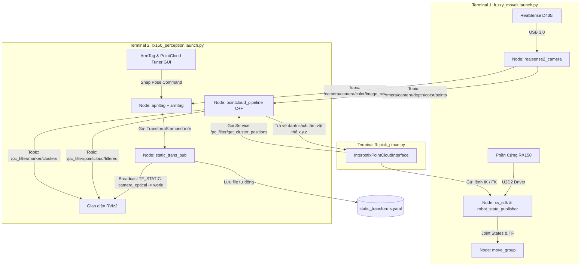

# BÁO CÁO VẬN HÀNH & NHẬT KÝ XỬ LÝ SỰ CỐ PERCEPTION - RX150

**Hệ thống:** Cánh tay Robot Interbotix RX150 + Camera Intel RealSense D435i + ROS 2 Humble  
**Bộ điều khiển:** `rx150_fuzzy_controller` (PWM closed-loop + MoveIt)  
**Pipeline Thị giác:** `interbotix_perception_modules` (PCL C++ Filter + ArmTag Calibration + Static TF Tools)  
**Ngày hoàn thiện:** 23/08/2026  

---

## MỤC LỤC
1. [Kiến Trúc Hệ Thống & Luồng Dữ Liệu](#1-kiến-trúc-hệ-thống--luồng-dữ-liệu)
2. [Quy Trình Vận Hành Chuẩn (SOP)](#2-quy-trình-vận-hành-chuẩn-sop)
   - [2.1 Khởi động Robot, MoveIt và Camera](#21-khởi-động-robot-moveit-và-camera)
   - [2.2 Khởi động Perception Pipeline & Hiệu chuẩn TF](#22-khởi-động-perception-pipeline--hiệu-chuẩn-tf)
   - [2.3 Sử dụng PointCloud Tuner GUI](#23-sử-dụng-pointcloud-tuner-gui)
   - [2.4 Chạy Demo Tự Động Gắp Thả](#24-chạy-demo-tự-động-gắp-thả)
3. [Nhật Ký Sự Cố Kỹ Thuật & Cách Khắc Phục (Troubleshooting Log)](#3-nhật-ký-sự-cố-kỹ-thuật--cách-khắc-phục)
   - [Sự cố 1: Không hiện mô hình Robot 3D trên RViz](#sự-cố-1-không-hiện-mô-hình-robot-3d-trên-rviz)
   - [Sự cố 2: Thêm PointCloud2 vào RViz nhưng màn hình trống trơn (Lỗi QoS)](#sự-cố-2-thêm-pointcloud2-vào-rviz-nhưng-màn-hình-trống-trơn-lỗi-qos)
   - [Sự cố 3: Đổi Fixed Frame về `world` thì PointCloud biến mất (Lỗi Multiple TF Parents)](#sự-cố-3-đổi-fixed-frame-về-world-thì-pointcloud-biến-mất-lỗi-multiple-tf-parents)
   - [Sự cố 4: MoveIt báo lỗi `Catastrophic failure / Unable to solve` khi về Home](#sự-cố-4-moveit-báo-lỗi-catastrophic-failure--unable-to-solve-khi-về-home)
   - [Sự cố 5: AprilTag bị lệch vị trí & Robot bị xoay 90 độ sau khi Snap](#sự-cố-5-apriltag-bị-lệch-vị-trí--robot-bị-xoay-90-độ-sau-khi-snap)
4. [Bảng Tra Cứu Cấu Hình & File Nguồn](#4-bảng-tra-cứu-cấu-hình--file-nguồn)

---

## 1. KIẾN TRÚC HỆ THỐNG & LUỒNG DỮ LIỆU

Hệ thống được thiết kế phân tầng rõ ràng, đảm bảo camera, thuật toán lọc điểm 3D và cánh tay robot phối hợp chuẩn xác theo kiến trúc chính hãng Interbotix:



---

## 2. QUY TRÌNH VẬN HÀNH CHUẨN (SOP)

### 2.1 Khởi động Robot, MoveIt và Camera
Mở **Terminal 1**:
```bash
source ~/interbotix_ws/install/setup.bash
ros2 launch rx150_fuzzy_controller fuzzy_moveit.launch.py \
    use_camera:=true \
    use_camera_static_tf:=false \
    use_handeye_publisher:=false
```
*(Nếu muốn chạy mô phỏng không cắm dây robot thật, thêm tham số `use_sim:=true`).*

---

### 2.2 Khởi động Perception Pipeline & Hiệu chuẩn TF
Mở **Terminal 2**:
```bash
source ~/interbotix_ws/install/setup.bash
ros2 launch rx150_perception rx150_perception.launch.py \
    use_pointcloud_tuner_gui:=true \
    use_armtag_tuner_gui:=true \
    use_rviz:=true
```

**Cách hiệu chuẩn ArmTag (Chỉ cần làm 1 lần hoặc khi di chuyển camera):**
1. Đưa tay robot ra trước camera sao cho tấm AprilTag (tag36h11 id 0) nằm rõ nét trong khung nhìn.
2. Trên cửa sổ **Armtag Tuner GUI**, tăng `Number of Snapshots` lên **10**.
3. Bấm **`Snap Pose`**.
4. Hệ thống sẽ tự động tính ma trận biến đổi chính xác, cập nhật RViz ngay lập tức và lưu đè vào `config/static_transforms.yaml`.

---

### 2.3 Sử dụng PointCloud Tuner GUI
Trên cửa sổ **PointCloud Tuner GUI** và RViz:
1. **Bật các mục hiển thị trong RViz:**
   - `FilteredPointCloud` (`/pc_filter/pointcloud/filtered`)
   - `ObjectMarkers` (`/pc_filter/marker/clusters`)
   - `CropBox` (`/pc_filter/marker/cropbox`)
2. **Kéo chỉnh các thanh trượt:**
   - **`CropBox (X, Y, Z)`**: Co hẹp khung hộp xanh lá bao trọn khu vực đồ vật trên bàn, cắt bỏ tường và thân robot.
   - **`plane_dist_thresh`**: Tăng nhẹ lên khoảng $0.005 - 0.008\text{m}$ để mặt bàn biến mất hoàn toàn.
   - **`cluster_min_size`** & **`cluster_tol`**: Chỉnh đến khi thấy mỗi vật thể xuất hiện 1 viên bi màu (Marker) ổn định ở tâm.
3. Bấm nút **`Save Config`** để lưu tham số vào `config/filter_params.yaml`.

---

### 2.4 Chạy Demo Tự Động Gắp Thả
Mở **Terminal 3**:
```bash
source ~/interbotix_ws/install/setup.bash
cd ~/interbotix_ws/src/rx150_perception/demos
python3 pick_place.py
```
*(Script sẽ tự động quét tọa độ các cụm vật thể từ PointCloud và điều khiển tay gắp thả lần lượt từng vật).*

---

## 3. NHẬT KÝ SỰ CỐ KỸ THUẬT & CÁCH KHẮC PHỤC

### Sự cố 1: Không hiện mô hình Robot 3D trên RViz
* **Hiện tượng:** Khi chạy `standalone_perception.launch.py` hoặc thêm PointCloud vào RViz, chỉ có camera hoặc màn hình trống trơn, không có cánh tay robot 3D.
* **Nguyên nhân:** File standalone chỉ chạy riêng camera, không khởi động `robot_state_publisher` và không nạp file mô hình URDF (`robot_description`).
* **Khắc phục:** Tích hợp quy trình chuẩn: Terminal 1 chạy `fuzzy_moveit` (chịu trách nhiệm phát URDF và TF toàn bộ khớp robot), Terminal 2 nạp perception và kết nối vào cây TF chung.

---

### Sự cố 2: Thêm PointCloud2 vào RViz nhưng màn hình trống trơn (Lỗi QoS)
* **Hiện tượng:** Topic `/camera/camera/depth/color/points` có dữ liệu bắn về nhưng RViz không vẽ bất kỳ điểm nào.
* **Nguyên nhân:** RealSense phát PointCloud theo chuẩn **`Best Effort` (Sensor Data QoS)**, nhưng mặc định RViz2 lại lắng nghe theo chuẩn **`Reliable`**, khiến RViz âm thầm hủy bỏ toàn bộ gói tin điểm 3D.
* **Khắc phục:** 
  1. Trong mục `PointCloud2` trên RViz $\rightarrow$ mở rộng mục `Topic` $\rightarrow$ đổi `Reliability Policy` từ `Reliable` thành **`Best Effort`**.
  2. Đổi `Color Transformer` thành `RGB8`.

---

### Sự cố 3: Đổi Fixed Frame về `world` thì PointCloud biến mất (Lỗi Multiple TF Parents)
* **Hiện tượng:** Khi để Fixed Frame là `camera_color_optical_frame` thì thấy điểm, nhưng đổi về `world` hoặc `rx150/base_link` thì toàn bộ PointCloud biến mất và báo đỏ.
* **Nguyên nhân:** Lệnh static TF thủ công đặt `world` (Parent) $\rightarrow$ `camera_color_optical_frame` (Child). Trong khi RealSense driver bên trong đã phát `camera_color_frame` (Parent) $\rightarrow$ `camera_color_optical_frame` (Child). Một frame có **2 cha** làm cây TF bị đứt gãy.
* **Khắc phục:** Đảo đúng chiều theo chuẩn Interbotix: **`camera_color_optical_frame` làm Parent $\rightarrow$ `world` làm Child**:
  ```yaml
  - frame_id: camera_color_optical_frame
    child_frame_id: world
  ```
  Chuỗi TF liền mạch hoàn hảo: `camera_link` $\rightarrow$ `camera_color_optical_frame` $\rightarrow$ `world` $\rightarrow$ `rx150/base_link`.

---

### Sự cố 4: MoveIt báo lỗi `Catastrophic failure / Unable to solve` khi về Home
* **Hiện tượng:** Khi ra lệnh cho robot về tư thế Home hoặc gắp vật, MoveIt lập tức hủy và báo lỗi `Catastrophic failure`.
* **Nguyên nhân:**
  1. MoveIt tự nạp `sensors_3d.yaml` (OctoMap) từ RealSense. Do TF lệch nhẹ vài cm, OctoMap tạo các khối chướng ngại vật ảo 3D đè trực tiếp lên chính cánh tay robot $\rightarrow$ MoveIt phát hiện *"Start State is in Collision"* và chặn toàn bộ quỹ đạo.
  2. File SRDF semantic chưa bật `show_ar_tag:='true'`, khiến MoveIt coi tấm Tag là vật thể cứng va chạm với đầu kẹp.
  3. Giá trị `HOME_JOINTS` cũ bị gán nhầm sang Sleep Pose (gập sát đáy) va chạm với hộp bàn ảo.
* **Khắc phục:**
  1. Bổ sung tham số `use_octomap:=false` (mặc định tắt OctoMap cản trở) trong `fuzzy_moveit.launch.py`.
  2. Khai báo `show_ar_tag='true'` trong `declare_interbotix_xsarm_robot_description_launch_arguments`.
  3. Đổi `HOME_JOINTS` về `[0.0, 0.0, 0.0, 0.0, 0.0]` và tắt `add_table_collision: false`.

---

### Sự cố 5: AprilTag bị lệch vị trí & Robot bị xoay 90 độ sau khi Snap
* **Hiện tượng:** Sau khi bấm Snap, robot bị lệch vị trí hoặc bị quay ngang 90 độ so với thực tế.
* **Nguyên nhân:**
  1. Thông số `size` trong `tags.yaml` không khớp kích thước in thật (đang để 0.028m thay vì 0.030m).
  2. Chiều dán viền đen của AprilTag bị lệch góc so với hệ trục tọa độ robot trong file `ar_tag.urdf.xacro`.
* **Khắc phục:**
  1. Cập nhật vị trí gá Tag lùi lại $14\text{mm}$ (`xyz="-0.014 0 0.04155"`) và xoay bù góc `rpy="0 0 1.570796"` trong `ar_tag.urdf.xacro`.
  2. Bật cờ **`position_only:=true`** khi chạy ArmTag GUI để khóa cứng góc xoay hình học chuẩn của robot, chỉ lấy vị trí tâm $(X, Y, Z)$.

---

## 4. BẢNG TRA CỨU CẤU HÌNH & FILE NGUỒN

| File | Đường dẫn | Chức năng |
| :--- | :--- | :--- |
| **Launch Perception** | `rx150_perception/launch/rx150_perception.launch.py` | Khởi chạy PCL Filter + ArmTag + Static TF + RViz |
| **Cấu hình Lọc PCL** | `rx150_perception/config/filter_params.yaml` | Chứa thông số CropBox, Voxel, SAC Plane, Euclidean Cluster |
| **Ma trận TF Calib** | `rx150_perception/config/static_transforms.yaml` | Lưu ma trận biến đổi Camera $\rightarrow$ World |
| **Cấu hình Tag** | `rx150_perception/config/tags.yaml` | Định nghĩa ID và kích thước hình học tấm AprilTag |
| **Mô hình URDF Tag** | `interbotix_xsarm_descriptions/urdf/ar_tag.urdf.xacro` | Định nghĩa vị trí khớp gắn Tag trên cánh tay |
| **Demo Tự Động** | `rx150_perception/demos/pick_place.py` | Kịch bản mẫu quét cụm vật thể và thực hiện gắp thả |

