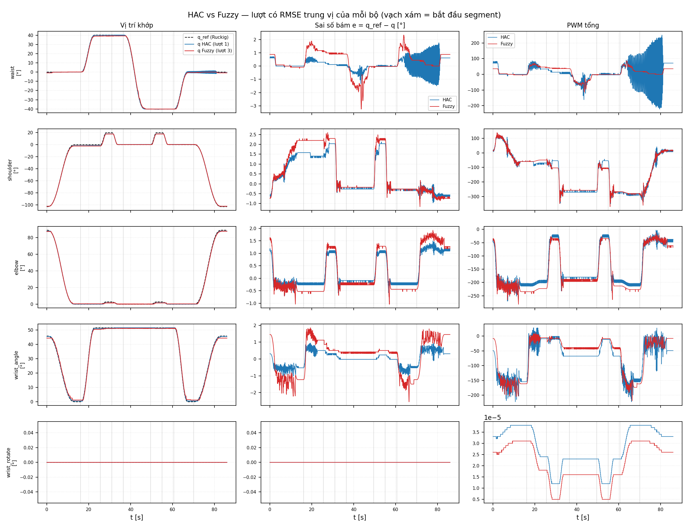
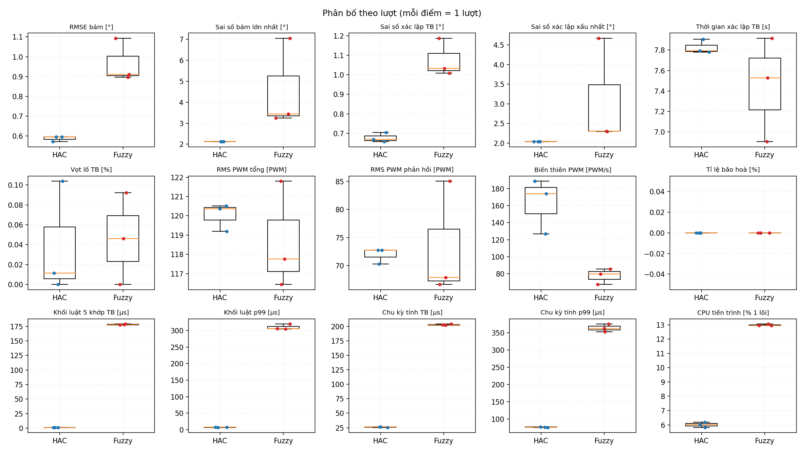
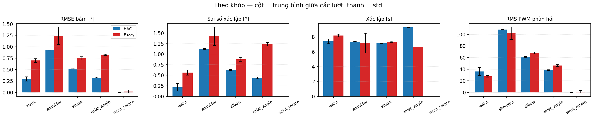

# So sánh HAC vs Fuzzy — `ab_slow2`

- Task: **slow_cycle**
- Số lượt: HAC 3 [1, 2, 3] · Fuzzy 3 [1, 2, 3]
- Băng xác lập: max(2 % |Δq|, 0.5°) · cửa sổ xác lập 0.5 s · khớp coi là chuyển động khi |Δq| ≥ 2.0°

## Kiểm công bằng

✓ Mọi tham số chung giống nhau: `loop_rate`, `debug_publish_rate`, `velocity_filter_tau`, `enable_profile`, `max_velocities`, `max_accelerations`, `max_jerk`, `sync_mode`, `u_max`, `enable_gravity_comp`, `Gff`, `gravity_sign`, `gravity_model_source`.

## Kết quả theo lượt

Δ% = (HAC − Fuzzy) / |Fuzzy|. Âm = HAC nhỏ hơn. Mọi chỉ số ở đây: **nhỏ hơn là tốt hơn**.

| chỉ số | HAC (mean ± std) | Fuzzy (mean ± std) | Δ% | Cohen d | p Welch | p MWU | tốt hơn |
|---|---|---|---|---|---|---|---|
| RMSE bám [°] | 0.588 ± 0.014 | 0.967 ± 0.11 | -39.2 | -4.9 | 0.025 * | 0.1 | HAC |
| Sai số bám lớn nhất [°] | 2.12 ± 0 | 4.58 ± 2.1 | -53.6 | -1.6 | 0.18 | 0.064 | HAC |
| Sai số xác lập TB [°] | 0.677 ± 0.024 | 1.08 ± 0.097 | -37.1 | -5.7 | 0.015 * | 0.1 | HAC |
| Sai số xác lập xấu nhất [°] | 2.04 ± 0 | 3.09 ± 1.4 | -34.1 | -1.1 | 0.31 | 0.064 | HAC |
| Thời gian xác lập TB [s] | 7.82 ± 0.07 | 7.45 ± 0.51 | 5.04 | 1 | 0.33 | 0.7 | Fuzzy |
| Số lần không vào băng | 4.33 ± 0.58 | 9 ± 1 | -51.9 | -5.7 | 0.0048 * | 0.077 | HAC |
| Vọt lố TB [%] | 0.0384 ± 0.057 | 0.0461 ± 0.046 | -16.7 | -0.15 | 0.86 | 1 | HAC |
| RMS PWM tổng [PWM] | 120 ± 0.73 | 119 ± 2.8 | 1.14 | 0.66 | 0.49 | 0.7 | Fuzzy |
| RMS PWM phản hồi [PWM] | 71.9 ± 1.4 | 73.2 ± 10 | -1.75 | -0.17 | 0.85 | 0.7 | HAC |
| Biến thiên PWM [PWM/s] | 163 ± 32 | 77.4 ± 9.2 | 111 | 3.6 | 0.036 * | 0.1 | Fuzzy |
| Tỉ lệ bão hoà [%] | 0 ± 0 | 0 ± 0 | — | — | — | — | = |
| Khối luật 5 khớp TB [µs] | 1.25 ± 0.0053 | 178 ± 0.83 | -99.3 | -3e+02 | 7.4e-06 * | 0.1 | HAC |
| Khối luật p99 [µs] | 6.95 ± 0.17 | 310 ± 8.4 | -97.8 | -51 | 0.00025 * | 0.1 | HAC |
| Chu kỳ tính TB [µs] | 26.1 ± 0.51 | 203 ± 1.1 | -87.1 | -2e+02 | 3.9e-07 * | 0.1 | HAC |
| Chu kỳ tính p99 [µs] | 76.8 ± 0.85 | 363 ± 11 | -78.9 | -36 | 0.00047 * | 0.1 | HAC |
| CPU tiến trình [% 1 lõi] | 6.01 ± 0.18 | 13 ± 0.06 | -53.7 | -52 | 5.5e-05 * | 0.1 | HAC |

`*` p < 0.05 (Welch). Với n < 5 mỗi bộ, p-value chỉ mang tính tham khảo — Mann-Whitney với 3 vs 3 lượt không thể nhỏ hơn 0.1.

## Chi phí tính toán

| đại lượng | HAC | Fuzzy | Fuzzy / HAC |
|---|---|---|---|
| Khối luật, 5 khớp [µs] | 1.25 | 178 | **142×** |
| Khối luật, 1 khớp [µs] | 0.251 | 35.6 | **142×** |
| Chu kỳ tính [µs] | 26.1 | 203 | **7.78×** |
| Chu kỳ tính / ngân sách chu kỳ [%] | 1.04 | 8.11 | **7.78×** |
| Khối luật / ngân sách chu kỳ [%] | 0.0502 | 7.13 | **142×** |
| CPU cả tiến trình [% 1 lõi] | 6.01 | 13 | **2.16×** |

- **Khối luật** = vòng từng khớp trong `onTimer`, đo bằng `steady_clock` trong node. Bên HAC khối này còn gồm bù ma sát (`tanh`) mà Fuzzy không có — tức là đo thiệt cho HAC.
- **Chu kỳ tính** = từ sau watchdog tới khi publish lệnh: Ruckig + Pinocchio (hai bộ như nhau) + khối luật. Phần chung càng lớn thì tỉ lệ ở dòng này càng gần 1 — đó là thật, không phải lỗi đo.
- **CPU cả tiến trình** (`/proc/<pid>/stat`) gồm cả DDS và publish debug; HAC phát 7 topic debug, Fuzzy 5.
- Build hiện tại không bật tối ưu (`-O0`). Chi phí riêng của luật ở `-O0` và `-O2`, không nhiễu ROS: `./rx150.sh ab-bench`.

## Theo khớp (trung bình giữa các lượt)

| khớp | RMSE bám HAC / Fuzzy [°] | xác lập HAC / Fuzzy [°] | settle HAC / Fuzzy [s] | RMS PWM phản hồi HAC / Fuzzy |
|---|---|---|---|---|
| waist | 0.295 / 0.699 | 0.214 / 0.563 | 7.4 / 8.18 | 36.1 / 27.6 |
| shoulder | 0.928 / 1.24 | 1.12 / 1.43 | 7.36 / 7.17 | 108 / 102 |
| elbow | 0.524 / 0.747 | 0.622 / 0.878 | 7.14 / 7.34 | 61.1 / 68 |
| wrist_angle | 0.325 / 0.823 | 0.438 / 1.24 | 9.28 / 6.66 | 38.3 / 46.4 |
| wrist_rotate | 0.000785 / 0.0185 | — / — | — / — | 0.0914 / 1.27 |

## Hình

## Đọc số thế nào

- `e` là sai số so với quỹ đạo Ruckig (ref), không phải so với đích. RMSE bám thấp mà sai số xác lập cao nghĩa là bám tốt khi chạy nhưng thiếu lực ở cuối (ma sát / bù trọng lực).
- `RMS PWM phản hồi` = u − u_grav: phần do luật điều khiển tạo ra. So effort nên dùng cột này; PWM tổng bị bù trọng lực (giống nhau ở hai bộ) chi phối.
- `Biến thiên PWM` cao kèm dao động nhỏ quanh đích = rung/limit-cycle.
- Dữ liệu ở debug_publish_rate (thường 50 Hz): overshoot và max |e| có thể thấp hơn thực tế một chút vì đỉnh ngắn hơn 20 ms bị bỏ lỡ, như nhau ở cả hai bộ.
- File thô: `segments.csv` (từng segment × khớp), `trials.csv`, `summary.csv`, `per_joint.csv`.
